<h1>Форум для любителей животных</h1>

<h3>Стек технологий:</h3>
<ul>
<li>Разработка макет Figma</li>
<li>HTML/SASS/JavaScript</li>
<li>.NET C#</li>
<li>Сервер на основе HttpListener</li>
<li>СУБД PostgreSQL</li>
<li>Для работы с базой данных библиотека npgsql</li>
<li>Для обращения к внешним API HttpClient</li>
<li>Хранение картинок в API ImgBB</li>
<li>Для валидации FluentValidation</li>
<li>Кеширование в IMemoryCash</li>
<li>Session, Cookie</li>
</ul>

Схема базы данных:
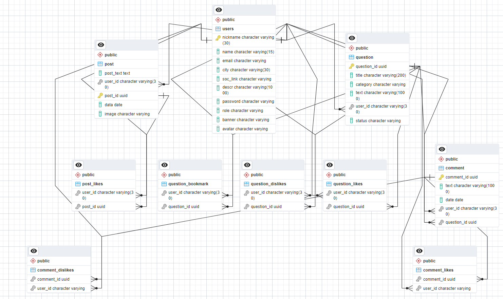

<h3>Реализованы следующие пользовательские сценарии:</h3>
<ul>
<li>Регистрация/авторизация</li>
<li>Общение на форуме: задать вопрос, написать ответ, поставить реакцию на пост или комментарий, сохранить пост в избранное. Вопросы делятся по категориям относительно животного</li>
<li>Профиль: написание постов(с картинкой), просмотр страниц других пользователей, реакция "нравится" на посты, просмотр понравившихся постов других пользователей, редактирование своего профиля</li>
<li>Модерация: при написании нового вопроса, пост проходит модерацию. Модератор может либо отклонить вопрос, либо одобрить его. Пользователь может зайти в свои вопросы и посмотреть в каком статусе находится вопрос.</li>
</ul>

<h3>Работа сайта:</h3>
Главная страница
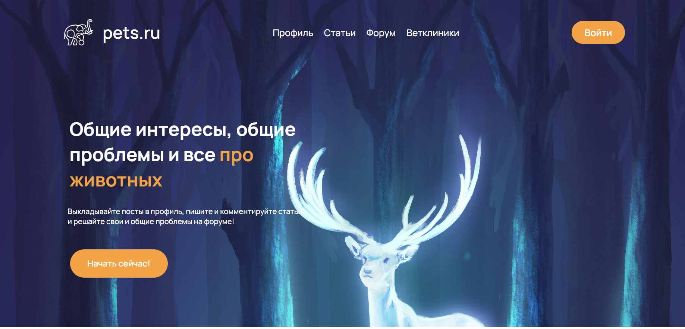

Авторизация/регистрация
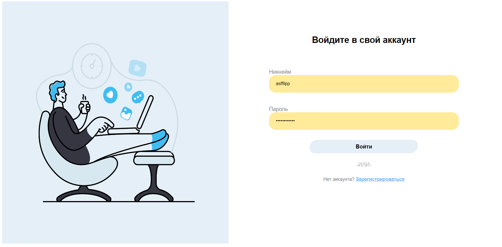
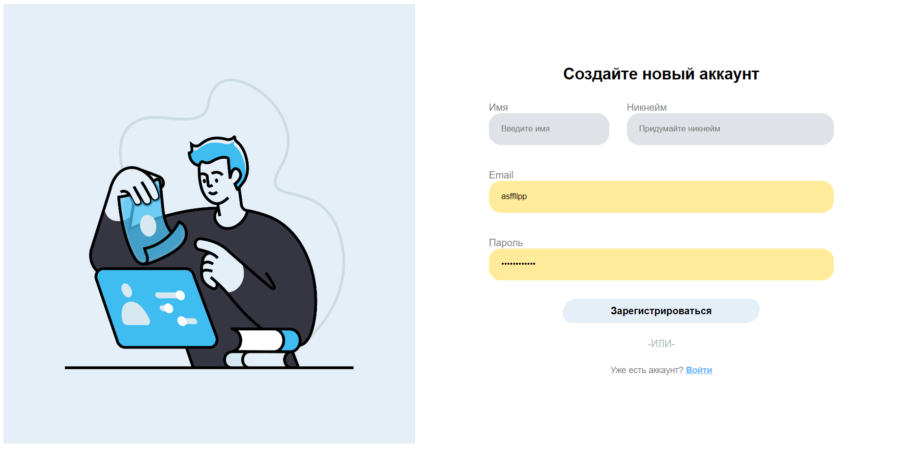

Свой профиль, есть возможность редактировать данные и писать посты
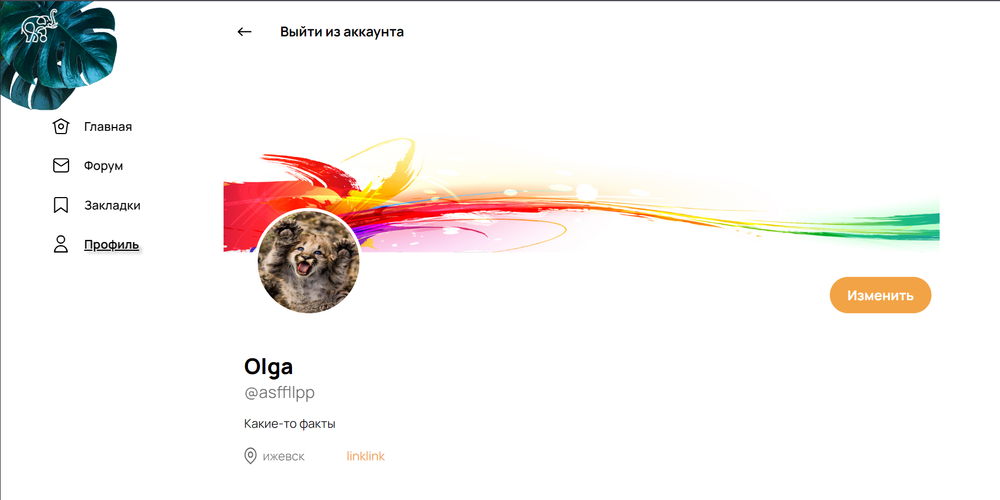
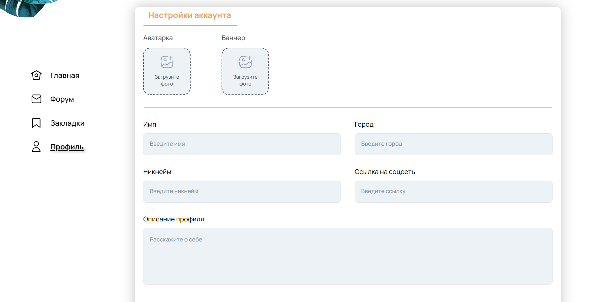
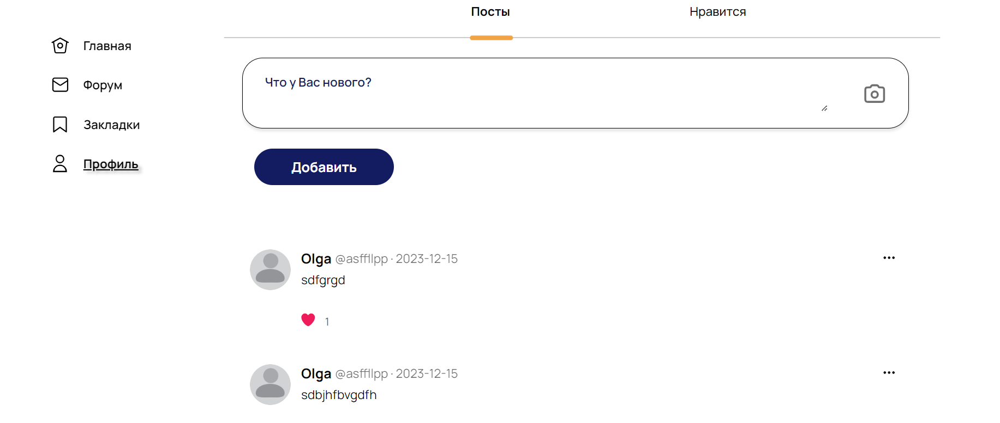

При заходе на чужой профиль можно только просматривать информацию и посты пользователя, ставить лайки и просматривать понравившиеся посты пользователя
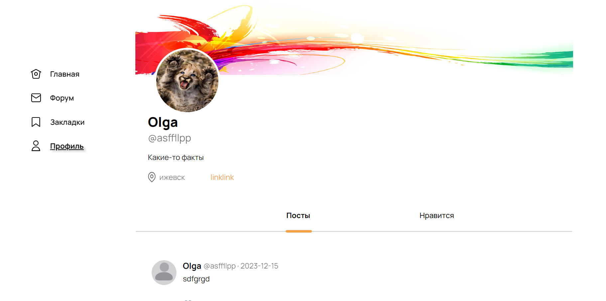
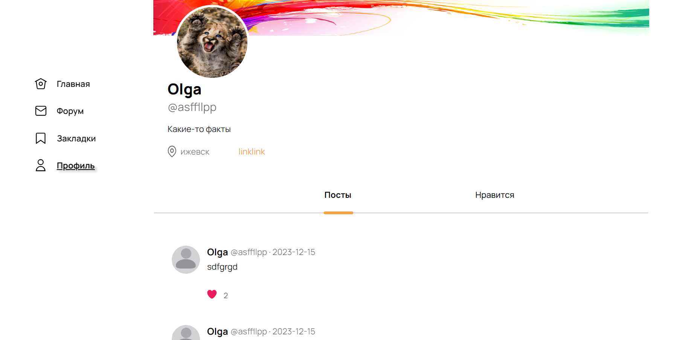

В разделе форума можно посмотреть все вопросы или отфильтровать по категориям, поставить лайк или дизлайк, а также добавить вопрос в избранное(если пользователь авторизирован)
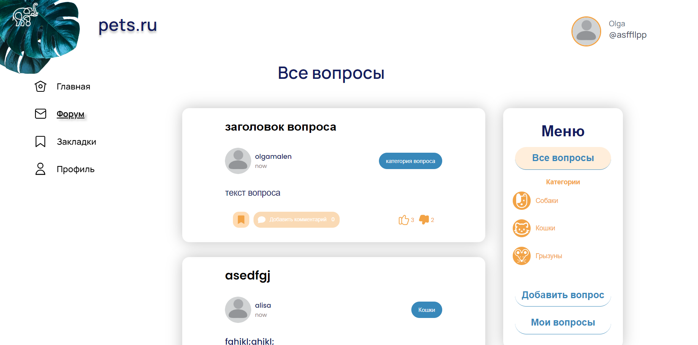
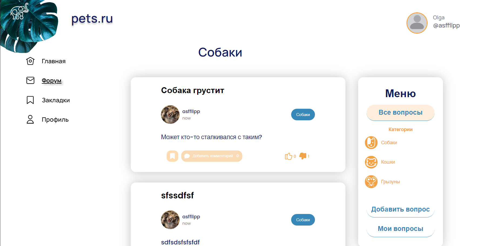

При заходе на вопрос можно перейти на страницу пользователя оставившего данный пост или комменарий пользователя, прокомментировать и оценить комментарии(при авторизации)
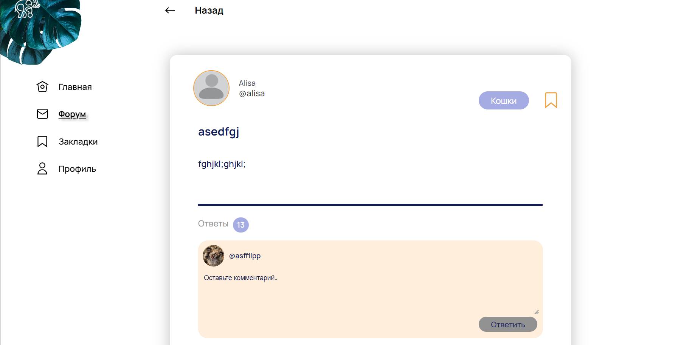
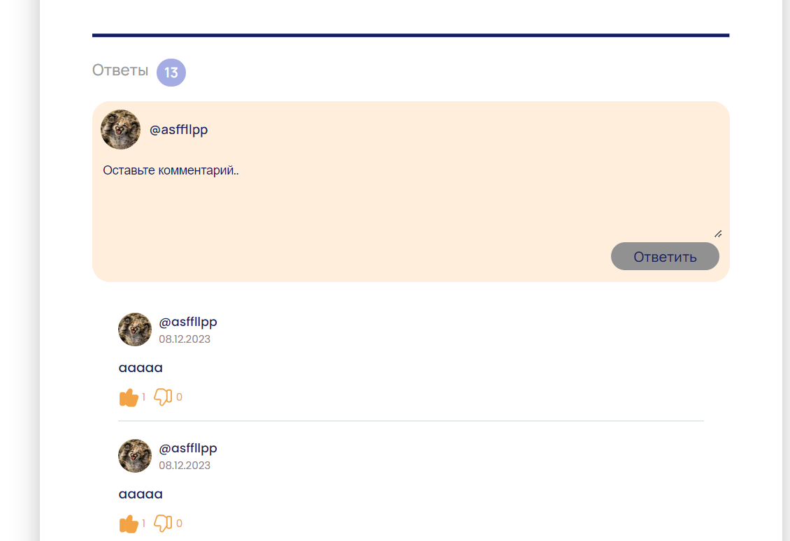

Добавить вопрос можно также при наличии авторизации
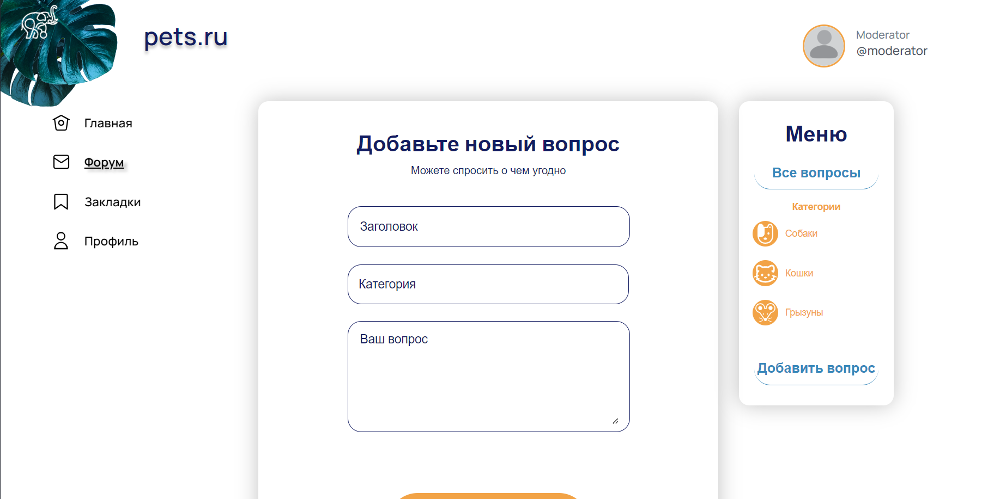
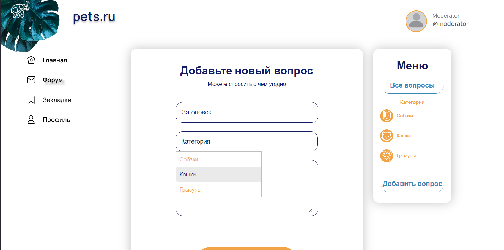

При заходе в мои вопросы появляются все вопросы, заданные пользователем и их статус обработки
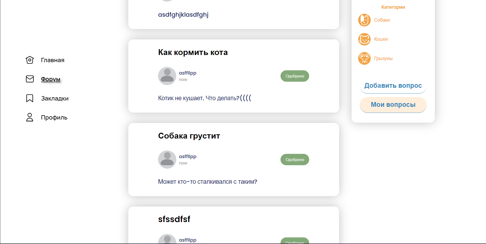

При заходе на ту же страницу через аккаунт модератора у него появляется список необработанных вопросов. Модертор обладает всем функционалом обычного пользователя + обработка вопросов.
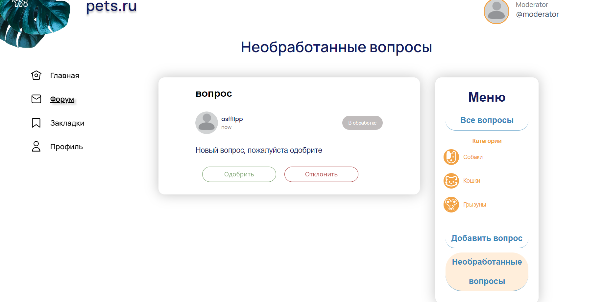