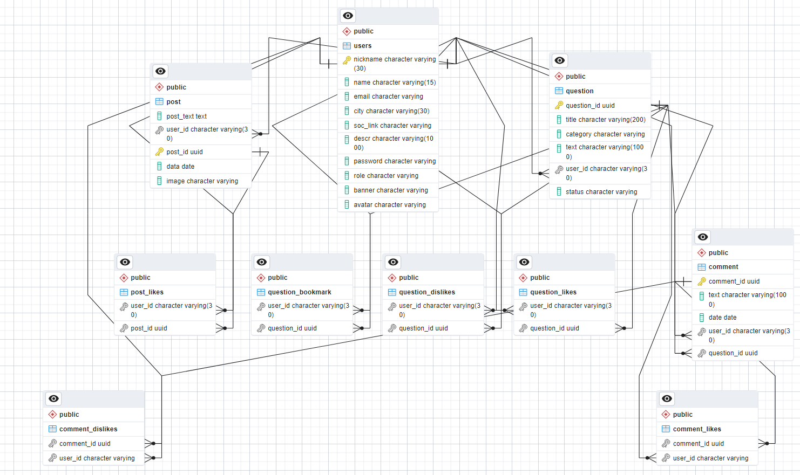

<h1>Форум для любителей животных</h1>

<h3>Стек технологий:</h3>
<ul>
<li>Разработка макет Figma</li>
<li>HTML/SASS/JavaScript</li>
<li>.NET C#</li>
<li>Сервер на основе HttpListener</li>
<li>СУБД PostgreSQL</li>
<li>Для работы с базой данных библиотека npgsql</li>
<li>Для обращения к внешним API HttpClient</li>
<li>Хранение картинок в API ImgBB</li>
<li>Для валидации FluentValidation</li>
<li>Кеширование в IMemoryCash</li>
<li>Session, Cookie</li>
</ul>

Схема базы данных:

<h3>Реализованы следующие пользовательские сценарии:</h3>
<ul>
<li>Регистрация/авторизация</li>
<li>Общение на форуме: задать вопрос, написать ответ, поставить реакцию на пост или комментарий, сохранить пост в избранное. Вопросы делятся по категориям относительно животного</li>
<li>Профиль: написание постов(с картинкой), просмотр страниц других пользователей, реакция "нравится" на посты, просмотр понравившихся постов других пользователей, редактирование своего профиля</li>
<li>Модерация: при написании нового вопроса, пост проходит модерацию. Модератор может либо отклонить вопрос, либо одобрить его. Пользователь может зайти в свои вопросы и посмотреть в каком статусе находится вопрос.</li>
</ul>
